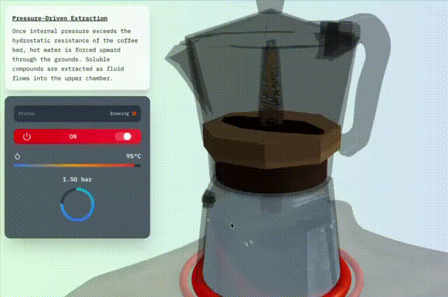

# Moka Pot Simulator 



An interactive **3D moka pot coffee maker simulator** built with **React Three Fiber** and powered by **MQTT** for real-time state updates.

This project visualizes the physical brewing process of a moka pot — from thermal expansion to pressure-driven extraction — while simulating live sensor data via an MQTT backend.

### Backend Simulator
- Node.js simulator acts as a virtual moka pot, publishing brewing data to an MQTT broker
- The React Three Fiber frontend subscribes to the data
- The 3D moka pot updates in real time as the coffee brews

---

## Installation Instructions

### 1. Clone the repository

### 2. Install dependencies
```bash
npm install
```

### 3. Set up MQTT (HiveMQ) and add .ENV variables
1. Go to https://www.hivemq.com/
2. Sign up for a free account
3. Create a new cluster
4. Copy the following credentials:
* Broker URL (HIVEMQ_BROKER_URL=mqtts://[url]:8884/mqtt, NEXT_PUBLIC_HIVEMQ_BROKER_URL=wss://[url]:8884/mqtt)
* Port
* Username/Password

### 4. Run the MQTT simulation
```bash
npm run simulator
```

### 5. Run the project
```bash
npm run dev
```

### 6. Open the project
Open [http://localhost:3000](http://localhost:3000) with your browser to see the result.


